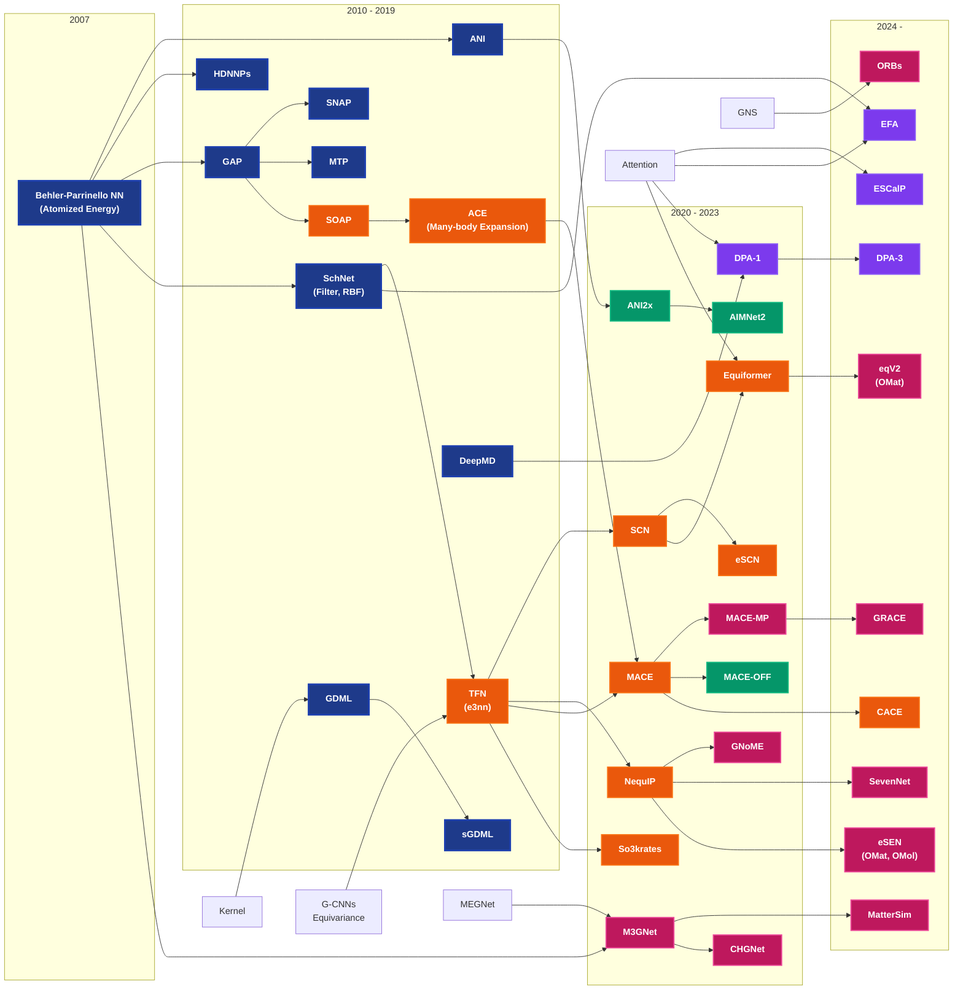

# Awesome Machine Learning Interatomic Potentials (MLIPs) 

```mermaid
%% Mermaid v10+ optimized vertical timeline
%% Enable in compatible Mermaid live editors: https://mermaid-js.github.io/mermaid-live-editor

flowchart LR

    subgraph "2007"
        BP["Behler-Parrinello NN<br/>(Atomized Energy)"]
    end

    subgraph "2010 - 2019"
        SOAP[SOAP]
        SchNet["SchNet<br/>(Filter, RBF)"]
        TFN["TFN<br/>(e3nn)"]
        ACE["ACE<br/>(Many-body Expansion)"]
        GDML[GDML]
        GAP[GAP]
        SNAP[SNAP]
        MTP[MTP]
        HDNNP[HDNNPs]
        ANI[ANI]
        DeepMD[DeepMD]
        sGDML[sGDML]
    end

    subgraph "2020 - 2023"
        M3GNet[M3GNet]
        CHGNet[CHGNet]
        SCN[SCN]
        eSCN[eSCN]
        Equiformer[Equiformer]
        NequIP[NequIP]
        MACE[MACE]
        MACE-MP["MACE-MP"]
        MACE-OFF["MACE-OFF"] 
        ANI2x[ANI2x]
        AIMNet2[AIMNet2]
        GNoME[GNoME]
        DPA1["DPA-1"]
        So3krates
    end

    subgraph "2024 - "
        GRACE[GRACE]
        eqV2["eqV2<br/>(OMat)"]
        MatterSim[MatterSim]
        SevenNet[SevenNet]
        ORBs[ORBs]
        DPA3["DPA-3"]
        CACE
        eSEN["eSEN<br/>(OMat, OMol)"]
        ESCalP[ESCalP]
        EFA
    end

    %% Edges
    BP --> ANI --> ANI2x --> AIMNet2
    BP --> HDNNP
    BP --> GAP --> SNAP
    BP --> SchNet --> TFN
    BP --> M3GNet
    Kernel --> GDML --> sGDML

    GAP --> MTP
    GAP --> SOAP --> ACE --> MACE 
    M3GNet --> MatterSim
    TFN --> SCN --> eSCN
    TFN --> NequIP 
    TFN --> MACE
    TFN --> So3krates
    MACE --> MACE-MP --> GRACE
    MACE --> MACE-OFF
    MACE --> CACE
    NequIP --> GNoME
    NequIP --> SevenNet
    NequIP --> eSEN
    MEGNet --> M3GNet --> CHGNet 

    G-CNNs["G-CNNs<br/>Equivariance"] --> TFN
    DeepMD --> DPA1
    Attention --> DPA1 --> DPA3
    Attention --> ESCalP
    Attention --> Equiformer --> eqV2
    Attention --> EFA
    SchNet --> EFA
    SCN --> Equiformer
    GNS --> ORBs

    %% Styling
    classDef architecture fill:#1e3a8a,stroke:#1e40af,stroke-width:3px,color:#fff,font-weight:bold
    classDef organic fill:#059669,stroke:#10b981,stroke-width:2px,color:#fff,font-weight:bold
    classDef attention fill:#7c3aed,stroke:#8b5cf6,stroke-width:2px,color:#fff,font-weight:bold
    classDef equivariance fill:#ea580c,stroke:#f97316,stroke-width:2px,color:#fff,font-weight:bold
    classDef universal fill:#be185d,stroke:#ec4899,stroke-width:2px,color:#fff,font-weight:bold

    class BP,ANI,HDNNP,GAP,SNAP,MTP,SchNet,DeepMD,GDML,sGDML architecture
    class SOAP,TFN,ACE,MACE,NequIP,Equiformer,eqV2,eSCN,eSEN,SCN,CACE,So3krates equivariance
    class ANI2x,AIMNet2,MACE-OFF organic
    class GNoME,MACE-MP,CHGNet,M3GNet,MatterSim,GRACE,SevenNet,eqV2,eSEN,ORBs universal
    class DPA1,DPA3,ESCalP,EFA attention

    %% Click links
    click BP "https://doi.org/10.1103/PhysRevLett.98.146401"
    click HDNNP "https://onlinelibrary.wiley.com/doi/full/10.1002/qua.24890"
    click GDML "https://doi.org/10.1126/sciadv.1603015"
    click SOAP "https://doi.org/10.1039/C6CP00415F"
    click SchNet "https://doi.org/10.48550/arXiv.1706.08566"
    click TFN "https://arxiv.org/abs/1802.08219"
    click ACE "https://doi.org/10.1103/PhysRevB.99.014104"
    click SCN "https://doi.org/10.48550/arXiv.2206.14331"
    click Equiformer "https://doi.org/10.48550/arXiv.2206.11990"
    click NequIP "https://doi.org/10.1038/s41467-022-29939-5"
    click MACE "https://arxiv.org/abs/2206.07697"
    click MACE-MP "https://arxiv.org/abs/2401.00096"
    click MACE-OFF "https://arxiv.org/abs/2312.15211"
    click CACE "https://doi.org/10.1038/s41524-024-01332-4"
    click DeepMD "https://doi.org/10.1103/PhysRevLett.120.143001"
    click GAP "https://doi.org/10.1103/PhysRevLett.104.136403"
    click ANI "https://doi.org/10.1039/C6SC05720A"
    click NEP89 "https://arxiv.org/abs/2504.21286"
    click EFA "https://arxiv.org/abs/2412.08541"
    click M3GNet "https://doi.org/10.1038/s43588-022-00349-3"
    click CHGNet "https://doi.org/10.1038/s42256-023-00716-3"
    click GRACE "https://doi.org/10.48550/arXiv.2311.16326"
    click So3krates "https://doi.org/10.48550/arXiv.2205.14276"
    click GNoME "https://doi.org/10.1038/s41586-023-06735-9"
    click SevenNet "https://pubs.acs.org/doi/10.1021/acs.jctc.4c00190"
    click MatterSim "https://doi.org/10.48550/arXiv.2405.04967"
    click GNS "https://doi.org/10.48550/arXiv.2002.09405"
```